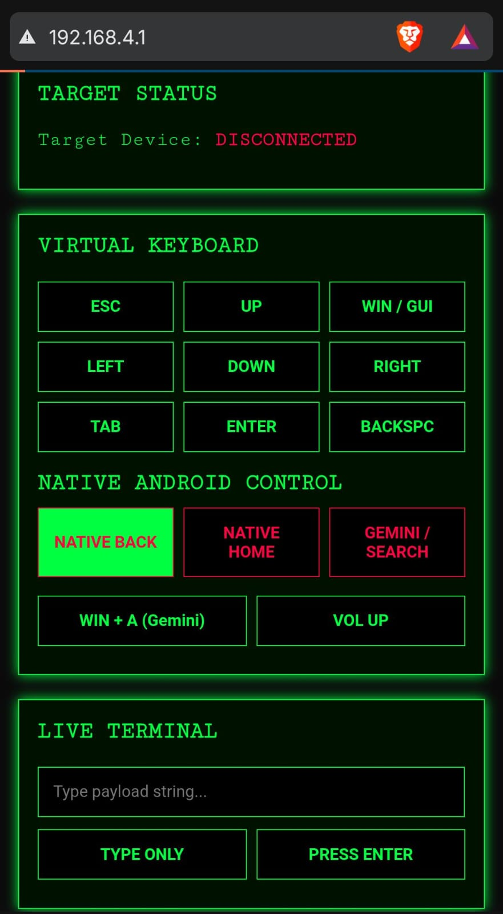

# Bluject
Turn an ESP32 into a stealthy, multi-OS keystroke injector. Bluject creates a local WiFi captive portal, letting you execute automated payloads and control targets via Bluetooth Low Energy directly from your phone.

# ⚡ Bluject v1.7
**Multi-OS BLE HID Injection Tool with Live Web Dashboard**

Bluject is a custom-built, wireless keystroke injection tool designed for the ESP32 microarchitecture. It acts as a rogue Bluetooth Low Energy (BLE) Human Interface Device (HID), allowing users to execute rapid, cross-platform payloads via a localized WiFi Captive Portal. 

---
## Interface

  

---
## 📡 Default Network Credentials
When Bluject is powered on, it broadcasts a localized, air-gapped WiFi network. You must connect to this network from your smartphone or computer to access the control dashboard.

* **WiFi Network Name (SSID):** `Bluject_AP`
* **WiFi Password:** `password123`
* **Dashboard Control IP:** `http://192.168.4.1`

---

## 📱 Usage Guide & Injection Methods

### Phase 1: Connection
1. **Power the Tool:** Plug the ESP32 into any 5V USB power source (laptop, wall charger, or power bank).
2. **Connect to Command Center:** Connect your smartphone to the `Bluject_AP` WiFi network and navigate to `http://192.168.4.1` in your browser.
3. **Pair the Target:** On the target machine (the device you are testing), open the Bluetooth settings and pair with the device named **`Dell Keyboard11XUA`**. 
4. **Verify:** Check your web dashboard. The status indicator will switch from red `DISCONNECTED` to green `CONNECTED`.

### Phase 2: Execution Methods
Once connected, you can use the web interface to interact with the target using three different methods:

* **Method 1: Virtual Keyboard & Native Control**
  Use the dashboard grid to send manual keystrokes (Enter, Tab, GUI/Windows key, Arrows). You can also trigger OS-level commands like volume control, native Android back/home buttons, or launch the voice assistant.
* **Method 2: Live Terminal Injection**
  Type any string of text into the Live Terminal input box. Hitting "TYPE ONLY" will rapidly inject that exact text into the target device as if typed on a physical keyboard.
* **Method 3: Payload Library**
  Pre-configured payload sequences (available in the source code) can execute complex attacks like opening a hidden terminal and downloading a script on Windows, macOS, or Android targets with a single button press.

---

## ⚙️ Setup & Hardware Requirements
* **Microcontroller:** ESP32 Development Board (Tested specifically on ESP32-D0WD-V3).

**CRITICAL COMPILATION WARNING:** To compile this project successfully, you must use a specific version of the ESP32 Arduino Core. Modern versions (3.0+) handle BLE memory allocation differently and will result in a `LoadProhibited` crash.
1. In the Arduino IDE, go to `Tools` > `Board` > `Boards Manager`. Downgrade/Install exactly **Version 2.0.17**.
2. Go to `Tools` > `Partition Scheme` and select **Huge APP (3MB No OTA/1MB SPIFFS)** to ensure the BLE radio has enough memory.

---

## ⚠️ Legal Disclaimer
**STRICTLY FOR EDUCATIONAL AND ETHICAL HACKING PURPOSES ONLY.** Bluject was developed to demonstrate the vulnerabilities of trust-based BLE pairings and the impact of rapid HID payload execution. The developer (Aro Mal) assumes absolutely no liability and is not responsible for any misuse, damage, or unauthorized access caused by this program. 

You are required to comply with all local, state, and federal laws. **DO NOT** use this tool on any systems, networks, or devices that you do not personally own or have explicit, documented permission to audit.
